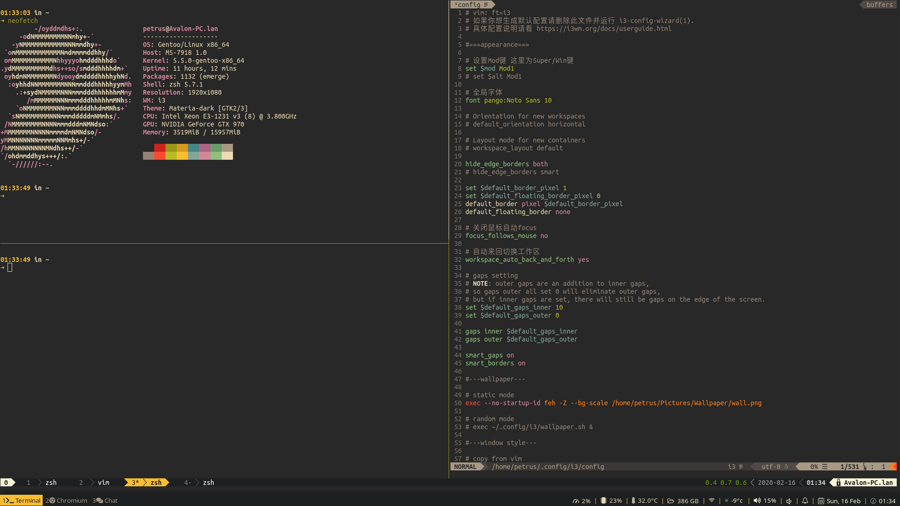

### Backup for gentoo, i3, vim and personal config files

#### Related:

* [AutoBackup](https://github.com/PetrusZ/AutoBackup)
* **[Using AutoBackup install Gentoo](https://gist.github.com/PetrusZ/947293692243c48fc21c744eb32f3816)**

#### Tools/Package

gentoo

i3-gaps & py3status

dunst & rofi

conky & Nerdfonts

etc.

#### Usage

install vim, zsh & tmux plugin

`bash ./install.sh`

#### Screenshot

#### License

[MIT](LICENSE)
